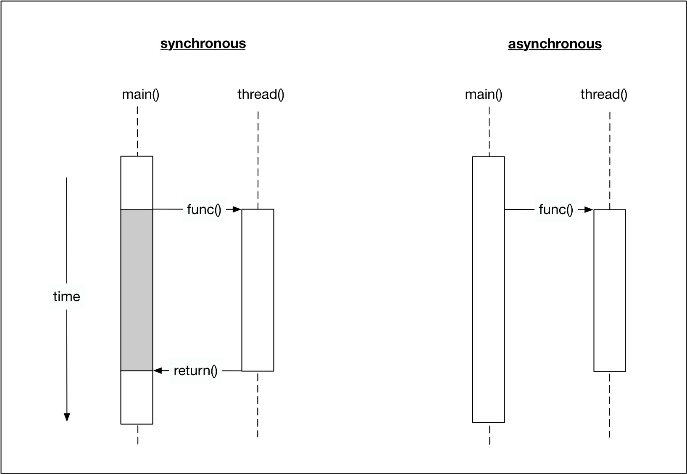

## Processes and Threads
In this lesson, you will learn how to start and manage your first parallel path of execution, which runs concurrently with the main program and is thus asynchronous. In contrast to synchronous programs, the main program can continue with its line of execution without the need to wait for the parallel task to complete. The following figure illustrates this difference.

Before we start writing a first asynchronous program in C++, let us take a look at the differences between two important concepts : processes and threads.

A process (also called a task) is a computer program at runtime. It is comprised of the runtime environment provided by the operating system (OS), as well as of the embedded binary code of the program during execution. A process is controlled by the OS through certain actions with which it sets the process into one of several carefully defined states:

- **Ready** : After its creation, a process enters the ready state and is loaded into main memory. The process now is ready to run and is waiting for CPU time to be executed. Processes that are ready for execution by the CPU are stored in a queue managed by the OS.
- **Running** : The operating system has selected the process for execution and the instructions within the process are executed on one or more of the available CPU cores.
- **Blocked** : A process that is blocked is one that is waiting for an event (such as a system resource becoming available) or the completion of an I/O operation.
- **Terminated** : When a process completes its execution or when it is being explicitly killed, it changes to the "terminated" state. The underlying program is no longer executing, but the process remains in the process table as a "zombie process". When it is finally removed from the process table, its lifetime ends.
- **Ready suspended** : A process that was initially in ready state but has been swapped out of main memory and placed onto external storage is said to be in suspend ready state. The process will transition back to ready state whenever it is moved to main memory again.
- **Blocked suspended** : A process that is blocked may also be swapped out of main memory. It may be swapped back in again under the same conditions as a "ready suspended" process. In such a case, the process will move to the blocked state, and may still be waiting for a resource to become available.
Processes are managed by the scheduler of the OS. The scheduler can either let a process run until it ends or blocks (non-interrupting scheduler), or it can ensure that the currently running process is interrupted after a short period of time. The scheduler can switch back and forth between different active processes (interrupting scheduler), alternately assigning them CPU time. The latter is the typical scheduling strategy of any modern operating system.

Since the administration of processes is computationally taxing, operating systems support a more resource-friendly way of realizing concurrent operations: the threads.

A thread represents a concurrent execution unit within a process. In contrast to full-blown processes as described above, threads are characterized as light-weight processes (LWP). These are significantly easier to create and destroy: In many systems the creation of a thread is up to 100 times faster than the creation of a process. This is especially advantageous in situations, when the need for concurrent operations changes dynamically.

Threads exist within processes and share their resources. As illustrated by the figure above, a process can contain several threads or - if no parallel processing is provided for in the program flow - only a single thread.

A major difference between a process and a thread is that each process has its own address space, while a thread does not require a new address space to be created. All the threads in a process can access its shared memory. Threads also share other OS dependent resources such as processors, files, and network connections. As a result, the management overhead for threads is typically less than for processes. Threads, however, are not protected against each other and must carefully synchronize when accessing the shared process resources to avoid conflicts.

Similar to processes, threads exist in different states, which are illustrated in the figure below:

- **New** : A thread is in this state once it has been created. Until it is actually running, it will not take any CPU resources.
- **Runnable** : In this state, a thread might actually be running or it might be ready to run at any instant of time. It is the responsibility of the thread scheduler to assign CPU time to the thread.
- **Blocked** : A thread might be in this state, when it is waiting for I/O operations to complete. When blocked, a thread cannot continue its execution any further until it is moved to the runnable state again. It will not consume any CPU time in this state. The thread scheduler is responsible for reactivating the thread.

## Lambdas
Another very useful way of starting a thread and passing information to it is by using a lambda expression ("Lambda" for short). With a Lambda you can easily create simple function objects.

The name "Lambda" comes from Lambda Calculus , a mathematical formalism invented by Alonzo Church in the 1930s to investigate questions of logic and computability. Lambda calculus formed the basis of LISP, a functional programming language. Compared to Lambda Calculus and LISP, C ++ - Lambdas have the properties of being unnamed and capturing variables from the surrounding context, but lack the ability to execute and return functions.

A Lambda is often used as an argument for functions that can take a callable object. This can be easier than creating a named function that is used only when passed as an argument. In such cases, Lambdas are generally preferred because they allow the function objects to be defined inline. If Lambdas were not available, we would have to define an extra function somewhere else in our source file - which would work but at the expense of the clarity of the source code.

A Lambda is a function object (a "functor"), so it has a type and can be stored and passed around. Its result object is called a "closure", which can be called using the operator () as we will see shortly.

A lambda formally consists of three parts: a capture list [] , a parameter list () and a main part {}, which contains the code to be executed when the Lambda is called. Note that in principal all parts could be empty.

The capture list []: By default, variables outside of the enclosing {} around the main part of the Lambda can not be accessed. By adding a variable to the capture list however, it becomes available within the Lambda either as a copy or as a reference. The captured variables become a part of the Lambda.

By default, variables in the capture block can not be modified within the Lambda. Using the keyword "mutable" allows to modify the parameters captured by copy, and to call their non-const member functions within the body of the Lambda. The following code examples show several ways of making the external variable "id" accessible within a Lambda.

Even though we have been using Lambdas in the above example in various ways, it is important to note that a Lambda does not exist at runtime. The runtime effect of a Lambda is the generation of an object, which is known as closure. The difference between a Lambda and the corresponding closure is similar to the distinction between a class and an instance of the class. A class exists only in the source code while the objects created from it exist at runtime.

We can use (a copy of) the closure (i.e. f0, f1, …) to execute the code within the Lambda at a position in our program different to the line where the function object was created.

The parameter list () : The way parameters are passed to a Lambda is basically identical to calling a regular function. If the Lambda takes no arguments, these parentheses can be omitted (except when "mutable" is used).

## Fork-Join Parallelism
Using threads follows a basic concept called "fork-join-parallelism". The basic mechanism of this concept follows a simple three-step pattern:

-  Split the flow of execution into a parallel thread ("fork")
-  Perform some work in both the main thread and the parallel thread
-  Wait for the parallel thread to finish and unite the split flow of execution again ("join")
The following diagram illustrates the basic idea of forking:

In the main thread, the program flow is forked into three parallel branches. In both worker branches, some work is performed - which is why threads are often referred to as "worker threads". Once the work is completed, the flow of execution is united again in the main function using the join() command. In this example, join acts as a barrier where all threads are united. The execution of main is in fact halted, until both worker threads have successfully completed their respective work.

By pushing the thread object into the vector, we attempt to make a copy of it. However, thread objects do not have a copy constructor and thus can not be duplicated. If this were possible, we would create yet another branch in the flow of execution - which is not what we want. The solution to this problem is to use **move** semantics, which provide a convenient way for the contents of objects to be 'moved' between objects, rather than copied. It might be a good idea at this point to refresh your knowledge on move semantics, on rvalues and lvalues as well as on rvalue references, as we will make use of these concepts throughout the course.
If you want to move an lvalue for example, we can call std::move.

To solve our problem, we can use the function emplace_back() instead of push_back(), which internally uses move semantics to move our thread object into the vector without making a copy. 

## two important properties of concurrent programs:

-  The order in which threads are executed is non-deterministic. Every time a program is executed, there is a chance for a completely different order of execution.
-  Threads may get preempted in the middle of execution and another thread may be selected to run.
These two properties pose a major problem with concurrent applications: A program may run correctly for 
